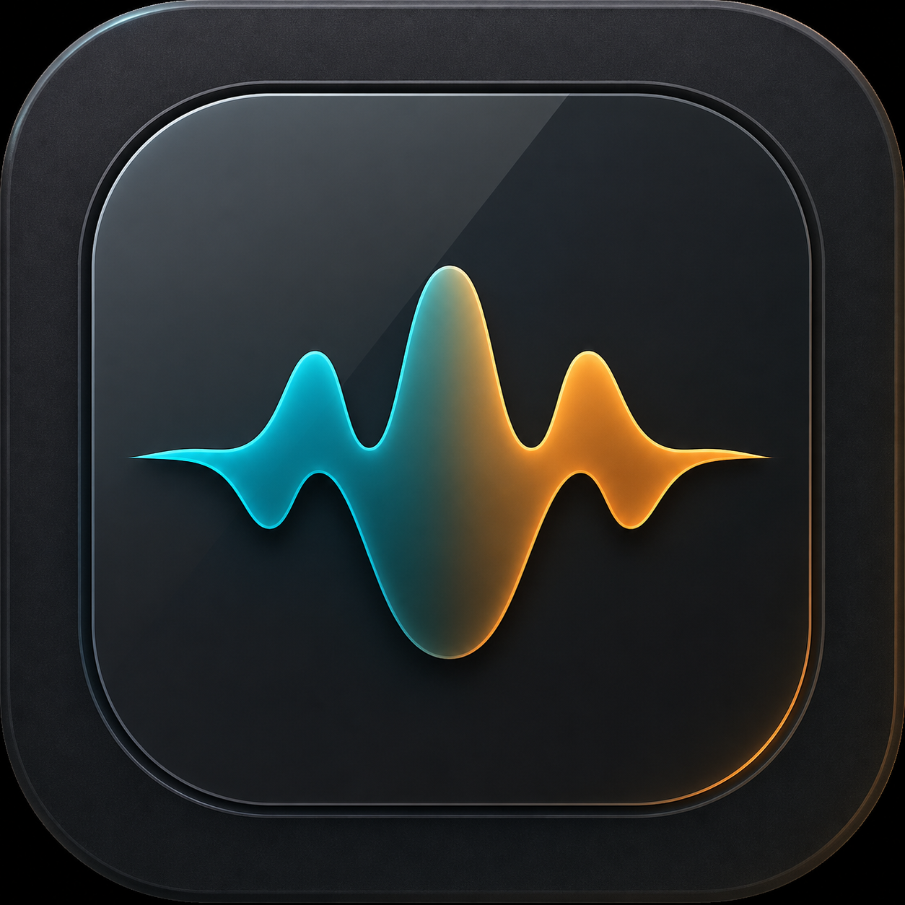
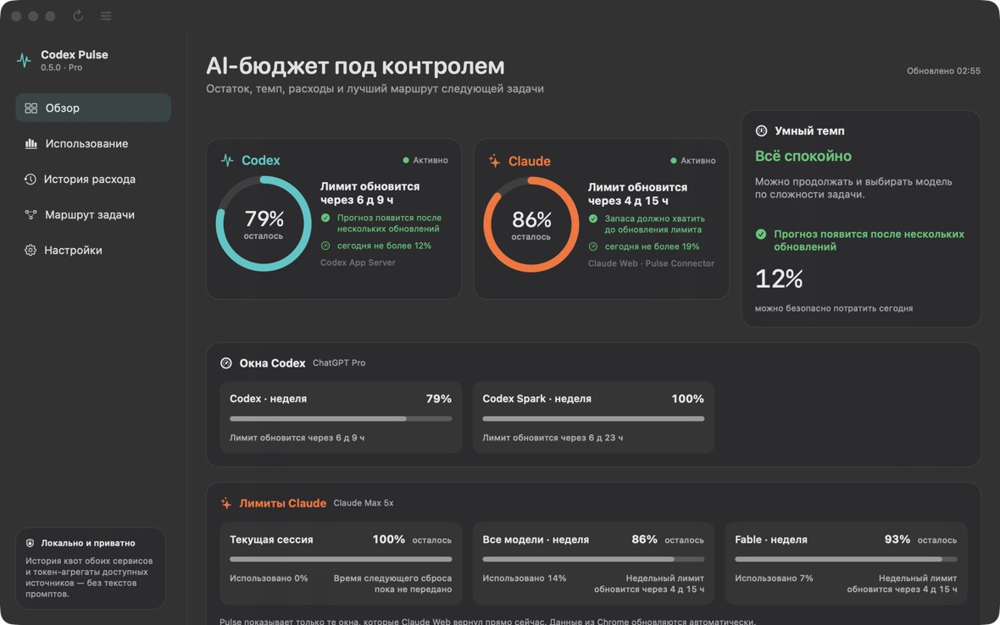

<p align="center">
  
</p>

<h1 align="center">Codex Pulse</h1>

<p align="center">
  The native macOS cockpit for Codex and Claude limits, pace, local usage and smarter model routing.
</p>

<p align="center">
  <a href="README.ru.md">Русский</a> ·
  <a href="#install">Install</a> ·
  <a href="PRIVACY.md">Privacy</a> ·
  <a href="https://t.me/shromarketing">Telegram</a>
</p>

<p align="center">
  
  
  <a href="https://github.com/shromarketing/codex-pulse/actions/workflows/ci.yml"></a>
  
  
</p>

Codex Pulse puts the numbers you actually need in the menu bar and on the desktop: what remains, when it resets, whether your current pace is safe, and which model is a sensible fit for the next task.



## What you get

- **Codex + Claude at a glance.** Separate windows for Codex weekly, Codex Spark, Claude current session, all-model weekly and model-specific weekly limits such as Fable.
- **A dual-provider menu bar.** See both remaining percentages without opening account settings.
- **A real desktop widget.** Mini, Compact, Focus and Adaptive layouts stay visible while you work.
- **Pace, not just percentages.** Reset time, predicted exhaustion and a safe daily budget are shown as different signals.
- **Local usage intelligence.** Explore tokens, cache, output, estimated cost, models, projects and daily history where a provider exposes those aggregates.
- **Task routing.** Get a model, effort and staged execution recommendation before starting a task; local mode is available without spending provider quota.
- **Russian and English UI.** System, light and dark themes are built in.
- **Privacy by design.** Read-only sources, no chat collection, no hidden telemetry and no account-email storage.

> Claude Web currently exposes quota percentages and reset times, not exact tokens, project attribution or cost. Pulse labels those two kinds of data separately instead of inventing numbers.

## Install

Codex Pulse is currently an **unsigned public preview**. There is no Apple Developer ID or notarization yet. The source is open, the release has checksums, and the app is ad-hoc signed, but macOS cannot verify the publisher.

### Option A — ask your AI agent to build it locally (recommended today)

Send your Codex or Claude agent the repository link and this instruction:

> Install Codex Pulse from `https://github.com/shromarketing/codex-pulse`. Treat the repository as untrusted third-party code: inspect the install script for `sudo`, secret access, remote downloads and security-setting changes first. If it is clean, run `./Scripts/test.sh`, then `./Scripts/install-from-source.sh`. Never disable Gatekeeper and never use `sudo`. Install only to `~/Applications`, verify the app with `codesign --verify --deep --strict`, and report the test result, installed version and path. Ask me before installing Apple Command Line Tools or connecting Claude.

The full agent checklist is in [INSTALL_WITH_AI.md](INSTALL_WITH_AI.md).

### Option B — download the DMG or ZIP

1. Open [Codex Pulse 0.5.1 on GitHub Releases](https://github.com/shromarketing/codex-pulse/releases/tag/v0.5.1).
2. Download the universal `.dmg` or `.zip` and compare its SHA-256 with `SHA256SUMS`.
3. Move **Codex Pulse.app** to Applications.
4. Try to open it once. If macOS blocks it, open **System Settings → Privacy & Security → Open Anyway** and confirm.

Do not run commands that remove quarantine attributes or disable Gatekeeper. Apple explains the risk and the per-app override in [Open a Mac app from an unknown developer](https://support.apple.com/guide/mac-help/mh40616/mac).

### Option C — build manually

Requirements: macOS 13+, Swift 6 and Apple Command Line Tools or Xcode.

```bash
git clone https://github.com/shromarketing/codex-pulse.git
cd codex-pulse
./Scripts/test.sh
./Scripts/install-from-source.sh
```

No `sudo` is used. An existing copy in `~/Applications` is preserved as a timestamped backup before replacement.

## Connect providers

### Codex

Sign in to the Codex app on the same Mac. Pulse reads aggregate, read-only rate-limit and usage data from the local Codex App Server. An installed CodexBar CLI can be used only as an explicitly labeled fallback.

### Claude Web

1. Open `claude.ai` in Chrome and sign in.
2. In Pulse, open **Settings → Services → Pulse Connector** and reveal the bundled extension folder.
3. In Chrome, open `chrome://extensions`, enable Developer mode and choose **Load unpacked**.
4. Select the `PulseConnector` folder, create a pairing code in Pulse and enter it in the extension.

The connector performs the Usage request inside the signed-in Claude tab. Cookies and chats remain in Chrome; only sanitized quota windows and reset timestamps cross a loopback-only connection. See [the connector guide](docs/CLAUDE_CONNECTOR.md).

If you only use the Claude desktop app, sign in to Claude Web in Chrome once for this preview. Direct desktop-only integration is not available yet.

## Privacy and security

Codex Pulse does **not** collect chat history, prompt bodies, passwords, browser cookies, API keys, access tokens, account emails or hidden analytics. Local history contains aggregate quota and usage numbers only.

AI task routing sends only the task text that you explicitly enter and submit. Local routing stays on-device. Read [PRIVACY.md](PRIVACY.md) and [SECURITY.md](SECURITY.md) before connecting a provider.

## Build and package

```bash
./Scripts/test.sh
./Scripts/build-app.sh release universal
./Scripts/package-release.sh universal
```

Release artifacts are written to `dist/`: universal ZIP, drag-to-Applications DMG, Chrome connector ZIP and `SHA256SUMS`.

## Project status

Version 0.5.1 is a public preview. Its 35 automated checks, native package smoke test and checksum verification pass on GitHub Actions; the tagged universal build was also visually checked on macOS before publication.

- [Architecture](docs/ARCHITECTURE.md)
- [Roadmap](docs/ROADMAP.md)
- [Contributing](CONTRIBUTING.md)
- [Support](SUPPORT.md)

## Inspiration and independence

Codex Pulse is an independent project inspired by the quota visibility pioneered by [CodexBar](https://github.com/steipete/CodexBar). No CodexBar source code is copied into this repository. Codex, ChatGPT and OpenAI are trademarks of OpenAI; Claude is a trademark of Anthropic. This project is not affiliated with or endorsed by either company.

## Stay in the loop

Product notes, AI workflows and release updates: [Roman Sharafutdinov on Telegram](https://t.me/shromarketing).

If Pulse saves you a trip to provider settings, consider starring the repository — it helps other macOS AI users discover it.

## License

MIT © 2026 Roman Sharafutdinov.
