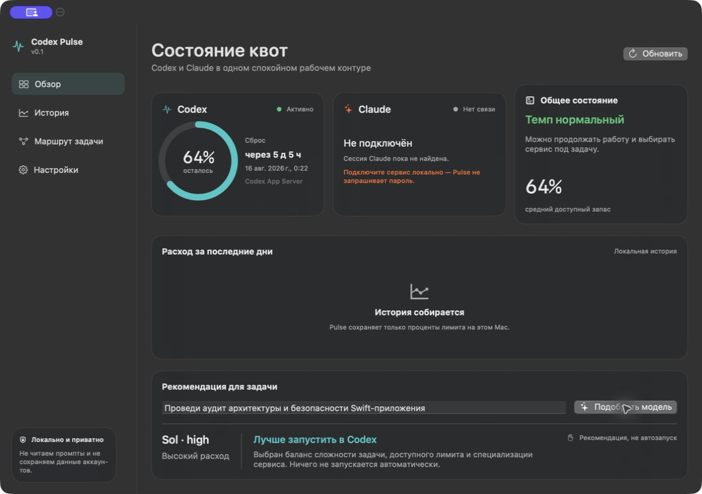

# Codex Pulse

Codex Pulse is a privacy-first native macOS companion for AI usage limits and task routing. It combines a menu-bar meter, an optional always-on-top widget, a full dashboard, and a local rule-based model recommendation in one app.

> Status: early local MVP. The repository is not published yet.



## Why it is different

Most quota tools answer **how much is left**. Codex Pulse also helps answer **whether the quota is likely enough and where a new task fits best**.

- Codex and Claude are first-class providers.
- Menu-bar, floating widget, and full-window modes share one state.
- Russian and English UI.
- System, light, and dark appearance.
- Selectable menu-bar representation: pulse, percentage, or two-provider view.
- Local deterministic task router: Luna, Terra, or Sol plus reasoning effort.
- No prompt collection, hidden telemetry, or automatic task execution.

## Requirements

- macOS 13 Ventura or newer.
- Apple Silicon or Intel Mac. The packaging script creates a universal binary by default.
- Swift 6 toolchain to build from source.
- Full Xcode is recommended for XCTest; the app itself also builds with Command Line Tools.
- Codex signed in locally for live Codex quota.
- For the current Claude adapter: a compatible local CodexBar/Claude session. A standalone direct Claude provider is planned before the first public stable release.

## Build

```bash
swift build
./Scripts/build-app.sh release universal
open CodexPulse.app
```

For a faster machine-native build, use `./Scripts/build-app.sh release native`.

## Data sources

- Codex: official Codex App Server, read-only `account/rateLimits/read`.
- Codex fallback: compatible local CodexBar CLI when available.
- Claude MVP: compatible local CodexBar bridge, which can reuse a locally connected Claude session.
- History: quota percentages stored locally in Application Support.

Codex Pulse never stores account email addresses, prompt text, cookies, or access tokens.

## What is verified in 0.1

- Universal Apple Silicon + Intel executable, ad-hoc signed for local use.
- Live Codex quota through the official interactive App Server handshake.
- Safe CodexBar fallback and Claude disconnected state.
- Russian/English switching, system/light/dark themes, model routing, and floating widget controls.

Claude live quota is implemented through a compatible local bridge, but it has not been smoke-tested on this Mac because no Claude session is connected. A direct provider remains a public-beta requirement.

## Project status

See [docs/ROADMAP.md](docs/ROADMAP.md), [docs/ARCHITECTURE.md](docs/ARCHITECTURE.md), and [design-qa.md](design-qa.md).

## Inspiration and attribution

Codex Pulse is an independent application inspired by the quota visibility pioneered by [CodexBar](https://github.com/steipete/CodexBar). No CodexBar source code is copied into this repository. The current optional compatibility bridge invokes an installed CodexBar CLI as a separate process.

## License

MIT © 2026 Roman Sharafutdinov.
